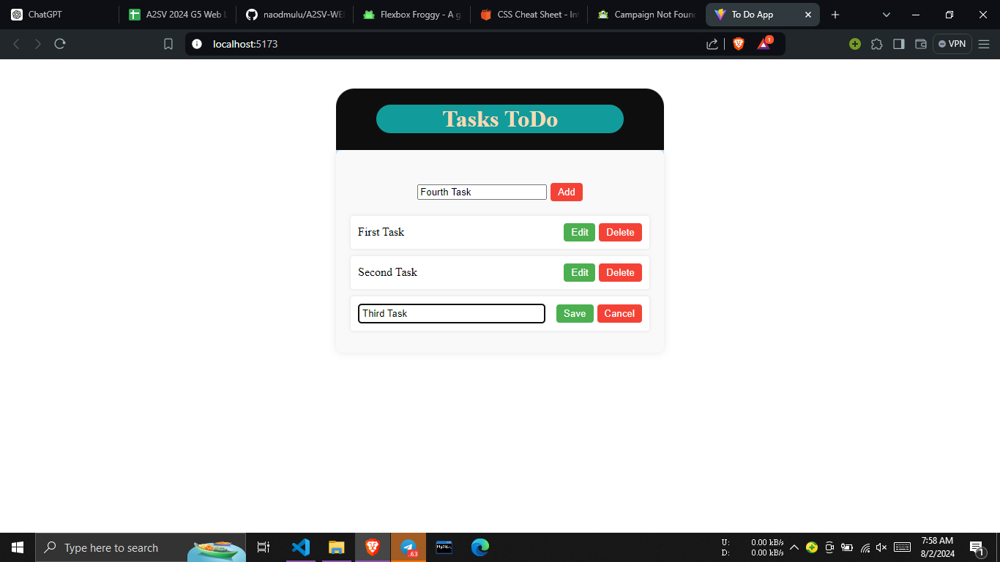

# Todo App

A simple Todo application built with React and TypeScript that allows users to add, edit, delete, and manage tasks. The application uses `localStorage` to persist tasks across browser sessions.

## Features

- **Add Tasks**: Users can add new tasks with a unique identifier.
- **Edit Tasks**: Users can edit existing tasks.
- **Delete Tasks**: Users can delete tasks they no longer need.
- **Persist Data**: Tasks are saved in `localStorage` to ensure data persistence across browser sessions.

## Installation

1. **Clone the repository**:
    ```bash
    git clone https://github.com/naodmulu/A2SV-WEB-tasks.git
    cd A2SV-WEB-tasks/"Task 4"
    ```

2. **Install dependencies**:
    ```bash
    npm install
    ```

3. **Start the application**:
    ```bash
    npm run dev
    ```

The application will be available at `http://localhost:5173/`.

## Usage


### Adding a Task

1. Enter the task description in the input field.
2. Click the "Add Task" button.

### Editing a Task

1. Click the "Edit" button next to the task you want to edit.
2. Modify the task description in the input field.
3. Click the "Save" button to save the changes or "Cancel" to discard them.

### Deleting a Task

1. Click the "Delete" button next to the task you want to delete.

